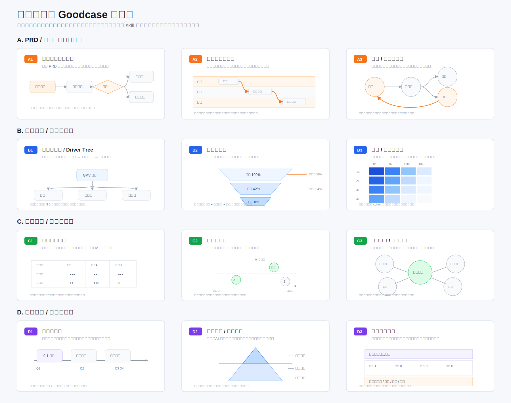

# structured-expression-designer

把复杂、零散或高密度内容，转成清晰、可编辑、可复用的结构化图形。

<p align="center">
  <strong>简体中文</strong> | <a href="./README_EN.md">English</a>
</p>



## 这是什么

`structured-expression-designer` 是一个面向结构化表达的 Codex Skill。

它不会收到内容后立刻套模板，而是先判断内容中的核心关系，例如流程、层级、对比、时间、因果、组成、网络或数据趋势，再推荐 2-3 个真正不同的表达方向。用户选择后，Skill 会继续生成适合二次编辑的图形或源代码。

适用场景包括：

- 业务流程与 PRD
- 会议纪要与研究笔记
- 知识体系与学习路径
- 数据分析与指标诊断
- 竞品分析与市场格局
- 战略规划与路线图
- 能力模型与汇报材料

## 核心能力

- **识别信息关系**：从原始文字中抽取对象、关系、层级、时间、数据和结论。
- **推荐图形方向**：根据核心问题、阅读对象和使用场景推荐 2-3 个方案。
- **解释表达取舍**：说明每种图形能突出什么、会牺牲什么。
- **统一内容模型**：先建立结构化中间层，再渲染成不同格式。
- **保证事实边界**：区分事实、推断、假设和占位，避免伪造数据或因果。
- **支持可编辑输出**：根据工具能力输出 Mermaid、draw.io XML、PPTX、SVG 或 Markdown。
- **执行视觉 QA**：检查阅读顺序、信息密度、文字溢出、数据口径和文件有效性。

## 图形库

| 类型 | 内置模板 |
|---|---|
| 顺序与状态 | 主路径流程图、角色泳道流程图、页面 / 状态流转图 |
| 数据与诊断 | 指标拆解树、漏斗诊断图、留存 / 分群热力图 |
| 对比与关系 | 能力对比矩阵、定位四象限、市场 / 生态关系图 |
| 战略与全景 | 战略路线图、能力模型 / 冰山分层、全景信息地图 |
| 通用结构 | 层级 / 分类树、时间轴 / 演进图、因果链 / 问题树、趋势 / 分布对比图 |

## 工作方式

```text
原始内容
   ↓
明确核心问题、读者和使用场景
   ↓
建立统一内容模型
   ↓
判断主要信息关系
   ↓
推荐 2-3 个图形方向
   ↓
用户选择或自动采用最优方案
   ↓
生成可编辑输出
   ↓
渲染与 QA
```

## 安装

```bash
git clone https://github.com/hankchn/structured-expression-designer.git
mkdir -p ~/.codex/skills/structured-expression-designer
cp -R structured-expression-designer/{SKILL.md,agents,assets,references} \
  ~/.codex/skills/structured-expression-designer/
```

安装完成后，重新打开 Codex 会话以加载 Skill。

## 使用

显式调用：

```text
使用 $structured-expression-designer 分析下面这段内容，
推荐 2-3 个合适的结构化表达方向，并说明各自的取舍：

<粘贴内容>
```

直接生成：

```text
使用 $structured-expression-designer 把这段业务流程整理成可编辑图形。
优先保证研发、运营和客服之间的责任边界清晰。
```

数据分析：

```text
使用 $structured-expression-designer 分析这组转化数据。
先判断适合漏斗、指标树还是趋势图，再生成汇报方案。
```

## 输出原则

| 格式 | 适合场景 |
|---|---|
| Mermaid | 流程、状态、时序、树图和快速迭代 |
| draw.io XML | 泳道、架构、复杂流程和关系图 |
| PPTX | 正式汇报、战略、竞品和路线图 |
| SVG | 文档插图、单页信息图和精修预览 |
| Markdown | 内容模型、矩阵、数据表和审阅草稿 |

只有当前工具确实能够创建对应文件时，Skill 才会承诺交付文件；否则会明确提供可复制源代码、页面结构或生成规格。

## 目录结构

```text
structured-expression-designer/
├── README.md
├── README_EN.md
├── SKILL.md
├── agents/
│   └── openai.yaml
├── assets/
│   └── structured-expression-goodcase-wall.svg
└── references/
    ├── content-model.md
    ├── goodcases.md
    ├── output-specs.md
    ├── selection-guide.md
    ├── templates.md
    └── visual-qa.md
```

## 设计原则

- 先判断信息关系，再判断业务场景。
- 一个图只回答一个核心问题。
- 推荐方向必须有表达重点差异，不能只是换颜色或方向。
- 数据不足时，不伪造评分、坐标、漏斗数值或因果结论。
- 复杂内容优先拆图，不靠缩小字号硬塞。
- 默认采用简约咨询风，强调清晰、克制和可编辑性。

## Goodcase

欢迎继续补充优质案例。案例进入 Skill 前，应能够说明：

- 解决了什么问题
- 使用了什么信息结构
- 哪些设计值得复用
- 哪些部分不应该模仿
- 对应哪个模板和输出格式

Skill 只沉淀可复用的结构和设计原则，不逐像素复制受版权保护的完整设计。
